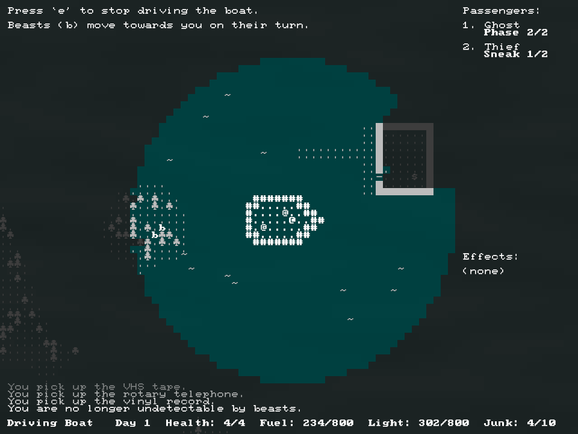
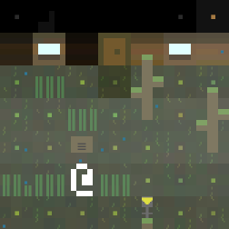
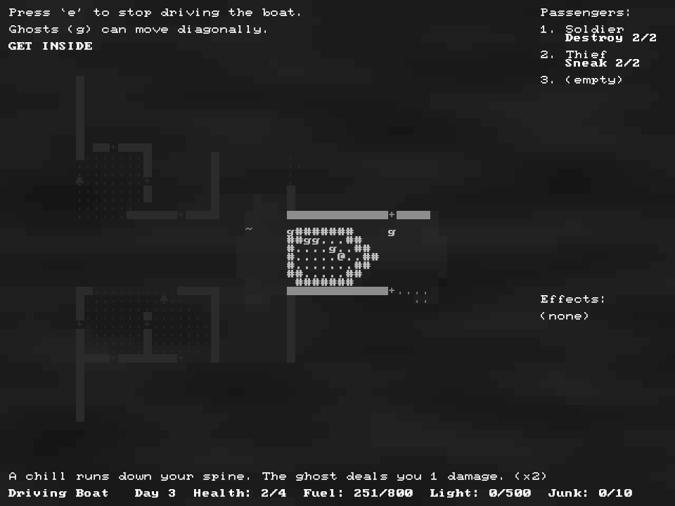
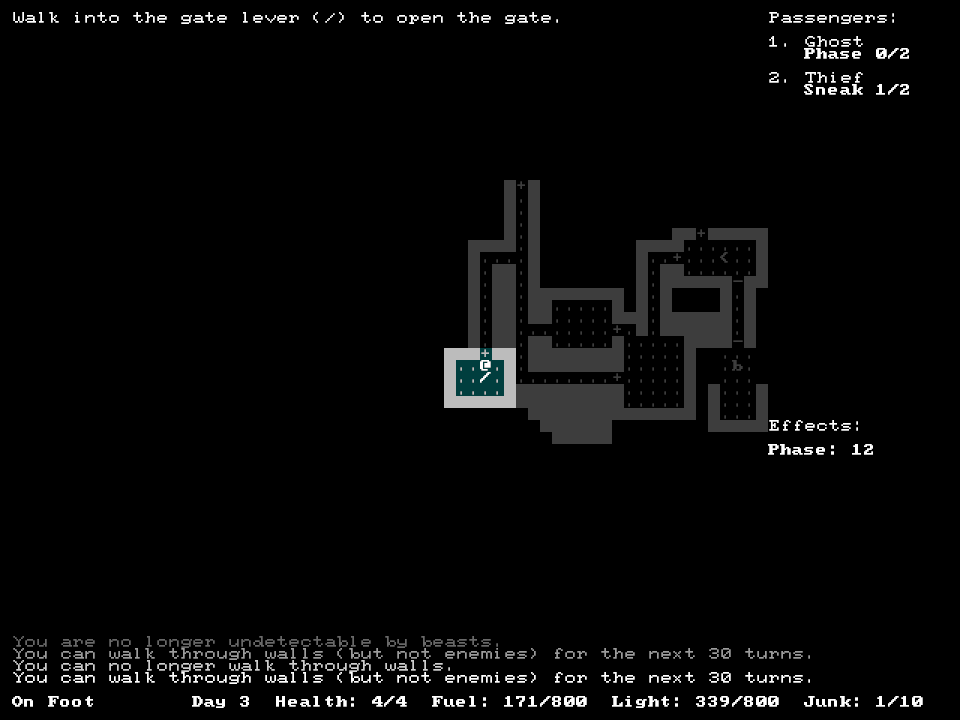
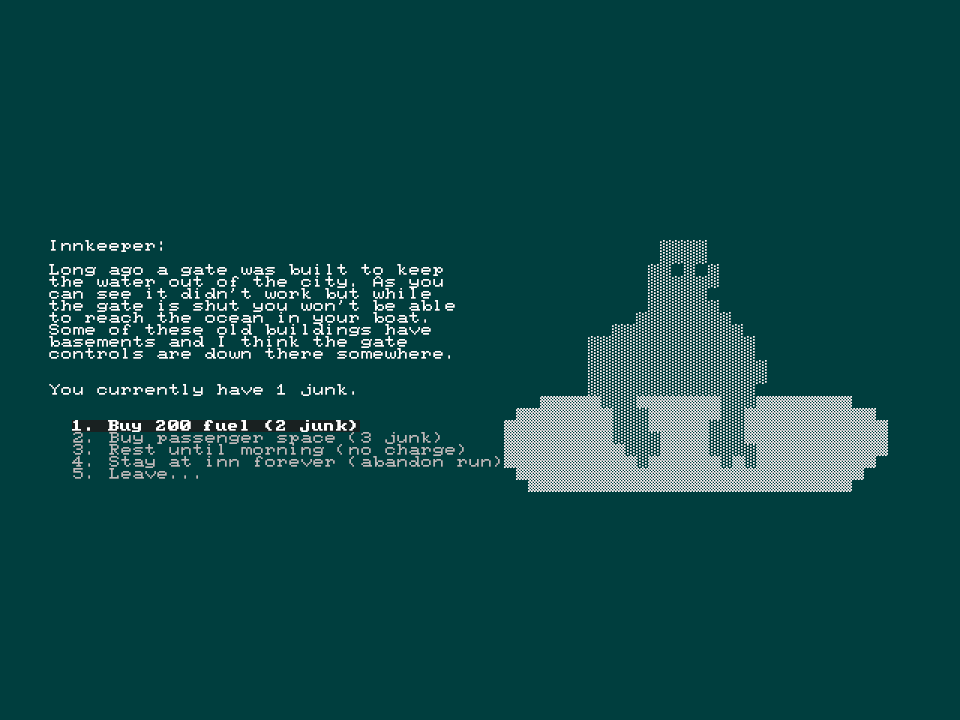
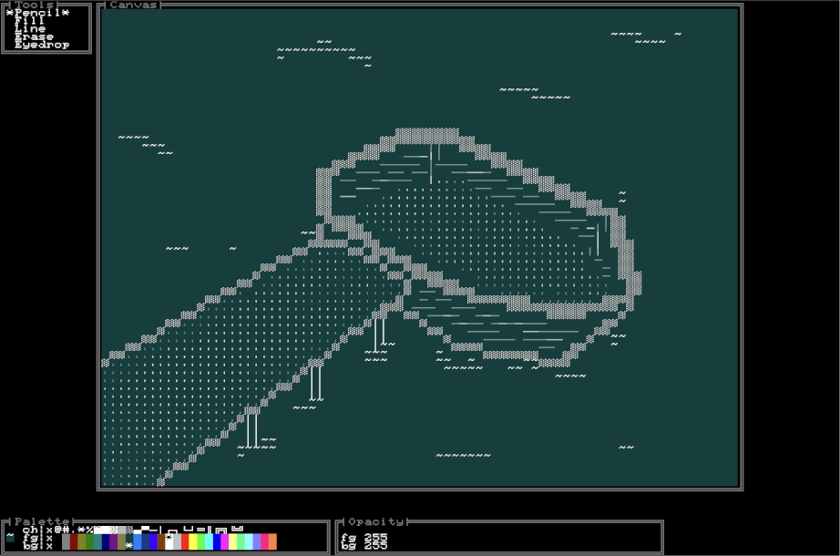

+++
title = "Boat Journey"
date = 2023-03-12
path = "boat-journey"

[taxonomies]
tags = ["gamedev", "roguelikes", "7drl", "project"]

[extra]
og_image = "cover.png"
+++

Boat Journey is a turn-based game where you drive a boat through a
procedurally-generated landscape on a voyage along a river destined for the
ocean. Accept passengers to have them help you on your journey. Fight monsters,
collect junk, trade the junk for fuel, use the fuel to travel to the ocean.

You can play it in a web browser or download the game from [gridbugs.itch.io/boat-journey](https://gridbugs.itch.io/boat-journey).

The source code for the game is at
[github.com/gridbugs/boat-journey](https://github.com/gridbugs/boat-journey).

<!-- more -->

This was my 8th 7drl. I'm relieved that the gameplay turned out to be fun
during last-minute playtesting. I've had the idea of making a game about
driving a boat to the ocean for a while and in my thought experiments before
making this game I struggled to come up with enjoyable short and medium term
game loops. But the loop of "collecting passengers so you can use their
abilities to steal junk from islands without getting defeated by beasts and then
you can use the junk to buy space for more passengers and also fuel for your
boat" actually turned out to be quite engaging.

This year I decided to make the art style very minimal. My last few 7drl entries
feature multiple characters per in-game tile which made it possible to create
very detailed graphics. Here's an example from last year's game Rain Forest.

While it looked beautiful it meant that every new type of object I added to the
game required designing a 3x3 character block to represent it which turned into a
lot of work over the course of the week. This year I'm back to using a single
character per in-game tile which meant I spent much less time making the game
pretty and more time on proc-gen and mechanics. That said I'm still very happy
with how it ended up looking.

Making a proc-gen river with proc-gen towns along it and the dungeons under the
city took 3 of the 7 days which is by far the most time I've spent on purely
getting procgen working for one of these. Normally I make a single level
generator with knobs that can be turned to change the levels as the game
progresses, normally just by adding more or tougher enemies. Boat Journey has 4
distinct terrain generators that all populate parts of a single large map. First
the game generates the path of the river and creates gaps for the town, swamp,
and city sections, and carves out the ocean. Then each of those sections is
populated by a terrain generator made just for that section. Finally the
dungeons under the city are generated, though I borrowed the dungeon generator
from a half-finished tutorial series I'm working on.

Also for the first time my game includes hand-drawn character portraits which
I'm quite happy with. I think the complement the moody, unsettling aesthetic I
was aiming for.

Before the jam I made a [tool](https://github.com/gridbugs/text-paint) to help draw images with text and I
used that tool for all the hand-drawn art in this game.

You can play or download Boat Journey here: [gridbugs.itch.io/boat-journey](https://gridbugs.itch.io/boat-journey).
