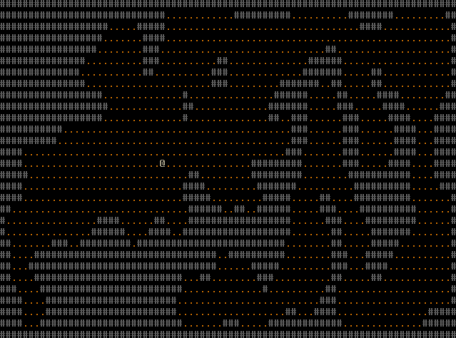

+++
title = "Cellular Automata Cave Generation"
date = 2015-09-26T12:30:01+10:00
path = "cellular-automata-cave-generation"

[taxonomies]
tags = ["gamedev", "roguelikes", "procgen"]
+++

A cellular automata is a collection of cells whose states change over time
based on the states of adjacent cells.
They can be used to produce natural-looking patterns, such as the cave
in the picture below.


<!-- more -->

Perhaps the most well-known instance of a cellular automata is [Conway's Game of Life](https://en.wikipedia.org/wiki/Conway%27s_Game_of_Life),
shown below (click to start). Each cell is considered to be either alive or dead.
In this example, the initial states of each cell is random.
At each step, the neighbours of each cell are examined to determine if that
cell will be alive or dead in the next step. This proceeds according to the following rules:

- if a cell is __alive__ and has __less than 2__ living neighbours, the cell dies (as if of underpopulation)
- if a cell is __alive__ and has __more than 3__ living neighbours, the cell dies (as if of overpopulation)
- if a cell is __alive__ and has __2 or 3__ living neighbours, the cell remains alive
- if a cell is __dead__ and has __exactly 3__ living neighbours, the cell becomes alive (as if by reproduction)

<div style="width:600px" class="centre">
<canvas id="conway" height="400" width="600"></canvas>
<p class="label">Conway's game of life. Click to toggle animation.</p>
</div>

Here's pseudocode for the function applied at each step of the simulation.
In short, it takes a 2D array of cells and updates the state of each cell
based on the states of its neighbours. 

```lua
SURVIVE_MIN = 2
SURVIVE_MAX = 3
RESURRECT_MIN = 3
RESURRECT_MAX = 3

step(cells[HEIGHT][WIDTH]) {
  for i in 0..HEIGHT-1 {
    for j in 0..WIDTH-1 {
      count = 0
      for each neighbour of cells[i][j] {
        if neighbour is alive {
          count++
        }
      }

      if cells[i][j].alive {
        if count >= SURVIVE_MIN and count <= SURVIVE_MAX {
          cells[i][j].alive_next_step = true
        } else {
          cells[i][j].alive_next_step = false
        }
      } else {
        if count >= RESURRECT_MIN and count <= RESURRECT_MAX {
          cells[i][j].alive_next_step = true
        } else {
          cells[i][j].alive_next_step = false
        }
      }
    }
  }

  for i in 0..HEIGHT-1 {
    for j in 0..WIDTH-1 {
      cells[i][j].alive = cells[i][j].alive_next_step
    }
  }
}
```

Notice the four constants
at the start of the code. These encode the rules for Conway's game of
life, described above. These values can be changed to obtain different
behaviour of the cellular automata.

- if a cell is __alive__ and has __less than 4__ living neighbours, the cell dies
- if a cell is __alive__ and has __4 or more__ living neighbours, the cell remains alive
- if a cell is __dead__ and has __exactly 5__ living neighbours, the cell becomes alive (as if by reproduction)

The constants that encode these rules are:

```lua
SURVIVE_MIN = 4
SURVIVE_MAX = 8
RESURRECT_MIN = 5
RESURRECT_MAX = 5
...
```

<div style="width:600px" class="centre">
<canvas id="conway-variant-1" height="400" width="600"></canvas>
<p class="label">Variant of Conway's game of life used for cave generation.</p>
</div>

These set of rules creates large clumps of living cells which can be used as the walls of a cave.
When generating terrain for a game level of finite size, players shouldn't be able to walk off the
edge of the map. A simple way to enforce this is to place walls around the edge of the map. A solution
that places natural-looking walls around the outside of the map is to ensure the border of the area
is always made up of living cells. Enforcing this at each step of the simulation means that these cells
cause other nearby cells to become (and stay) alive. The walls grow inwards and interact with interior
walls to give the appearance of natural cavern walls.

<div style="width:600px" class="centre">
<canvas id="conway-variant-2" height="400" width="600"></canvas>
<p class="label">Cells around border are always alive.</p>
</div>

Within the first few steps, natural-looking caverns are generated.
In the subsequent steps, the walls recede and the caverns become very vast.
Limiting the number of steps to 4 seems to produce interesting-looking caves.
Rough edges and single dead cells can be smoothed/removed by killing any cells
with less than 2 living neighbours, and resurrecting cells with more than 5 living neighbours.
Finally, to ensure that there are no closed-off sections of the generated cave,
all but the largest contiguous groups of dead cells are are resurrected, filling in closed-off open spaces.

<div style="width:600px" class="centre">
<canvas id="conway-variant-3" height="400" width="600"></canvas>
<p class="label">Running for 4 steps, then cleaning.</p>
</div>

<script src="lib/jquery.js"></script>
<script src="js/cellular-automata-cave-generation/index.js"></script>
