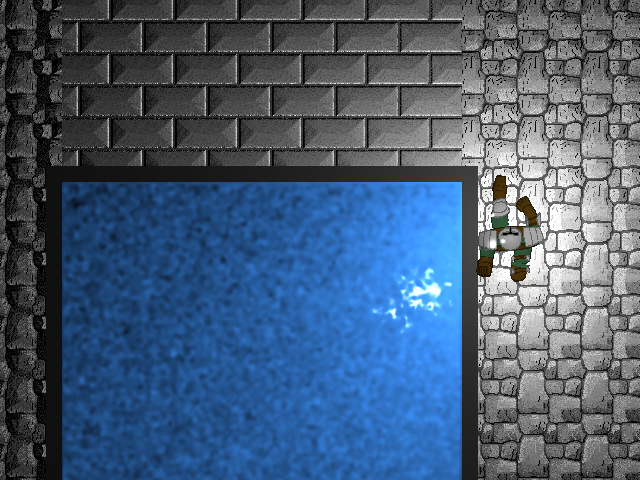

+++
title = "Post Mortem of an Abandoned Game"
date = 2015-07-12T22:46:01+10:00
path = "post-mortem-of-abandoned-game"

[taxonomies]
tags = ["gamedev"]
+++

I spent about 6 months of 2014 working in my spare time 
on what I hoped would become a top-down
side-scrolling action-rpg. I'd just started playing Dark Souls,
and wanted to emulate its art style and combat, but in 2D.

My aim from the start was to quickly implement features at a basic level, rather than getting bogged down in low-level details.
I implemented character animation, collision processing
and visible area detection over the course of several months. Often I would find myself starting to focus too much on one thing,
such as smooth interpolation between animation modes, or having characters slide along walls following a collision rather than
stopping abruptly. Nonetheless, I continued to make progress.

All the graphics were drawn using html canvas's 2D drawing context. I was interested in comparing the relative performance of 
the 2D drawing context and WebGL, which is native browser support for OpenGL ES.
I'd attempted to learn webgl on several occasions prior to this, but never had a project to apply it to until now.
I set about porting the low-level graphics functionality of the game to webgl, and unknowingly opened Pandora's box.

Suddenly I had the power of shaders at my fingertips. I poured endless hours into writing shaders and meticulously crafting
bump maps and light maps for various scenes and marveling at the speed at which complex graphical effects could be applied.
(Shaders are programs which run on massively parallel hardware (GPUs), and perform computations on each vertex in a scene, and
each pixel on the screen.) I wrote a blur filter, a pixelate filter, a phong illumination system that used a collection of
special images to give the illusion of 3D textures.

At this point I started to lose sight of where the project was going. The cost of adding new content was increased by the shiny new graphics
engine, as images needed accompanying bump and light maps. I was starting to approach the limit of computation which can be done
in a single frame on my development machine (a 2013 macbook air). I started to doubt whether top-down was really the best viewing angle for
the task at hand, and wondered if [3/4 perspective](lttp.jpg) would be more appropriate, or if purely top-down implied
a more [minimal art style](teleglitch.jpg). I experimented with different styles of drawing but couldn't settle
on anything I both liked and had the skill to create.

Eventually I decided I'd have better luck starting a new project from scratch. I learnt a lot about computer graphics and also about
how not to go about creating a game.

I decided to stop working on this project on a Friday night, and while liberating, it was also frustrating, so to prove
to myself that I could actually make games, I spent the weekend making
[this little platform game](https://games.gridbugs.org/unfinished-game/).

## Runnable versions of game engine (runs in browser)
- [Large area with buggy dynamic lighting and shaders](https://games.gridbugs.org/top-down-sidescrolling-engine)
- [Large area with dynamic lighting but no shaders](https://games.gridbugs.org/abandoned-game-big-noshaders)
- [Small area with dynamic lighting but no shaders](https://games.gridbugs.org/abandoned-game-small)

## Shader demos
- [Irregular pavement shader demo](https://games.gridbugs.org/old-webgl-shader-demos/pavement/artwork/shaders/irregular_pavement)
- [Tiles shader demo](https://games.gridbugs.org/old-webgl-shader-demos/tiles/)
- [Waves shader demo](https://games.gridbugs.org/old-webgl-shader-demos/waves/)
- [source code](https://github.com/gridbugs/old-webgl-shader-demos)
