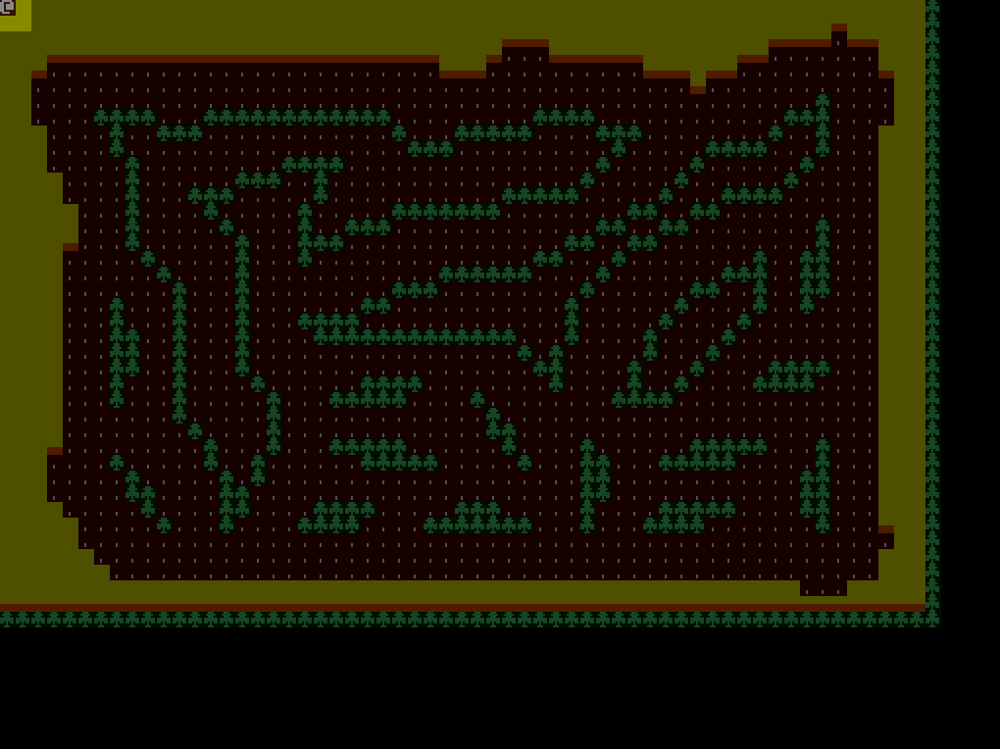
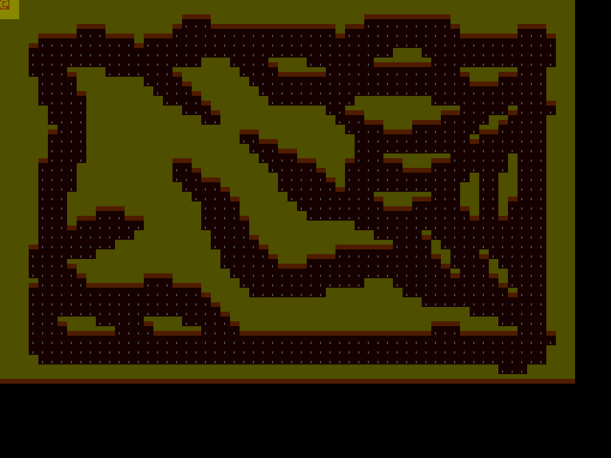
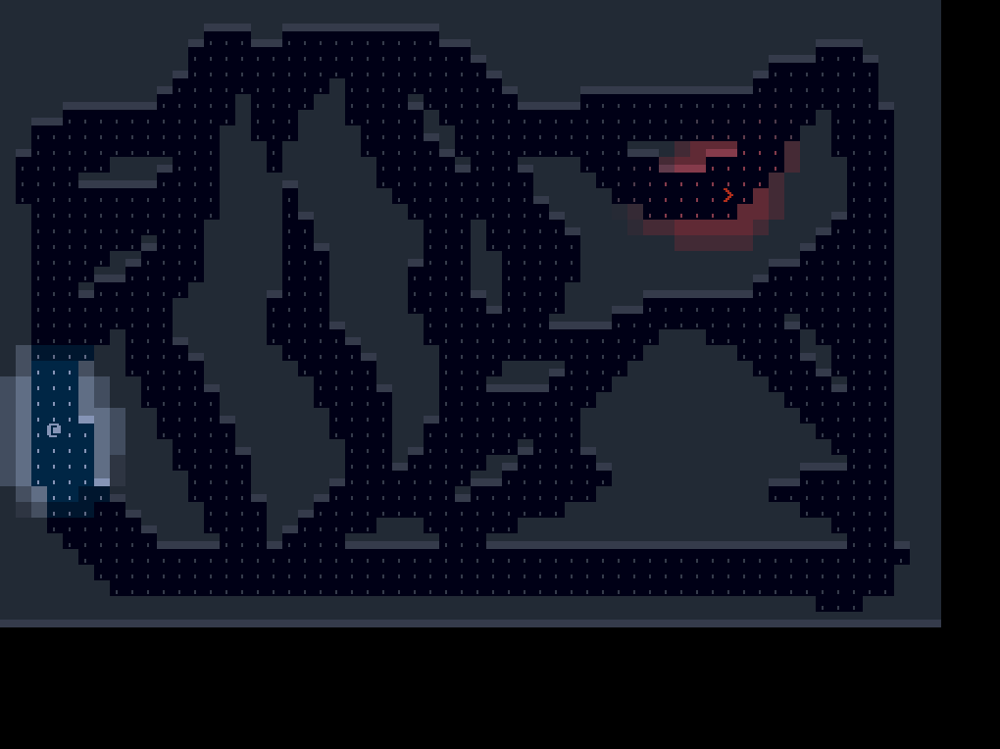
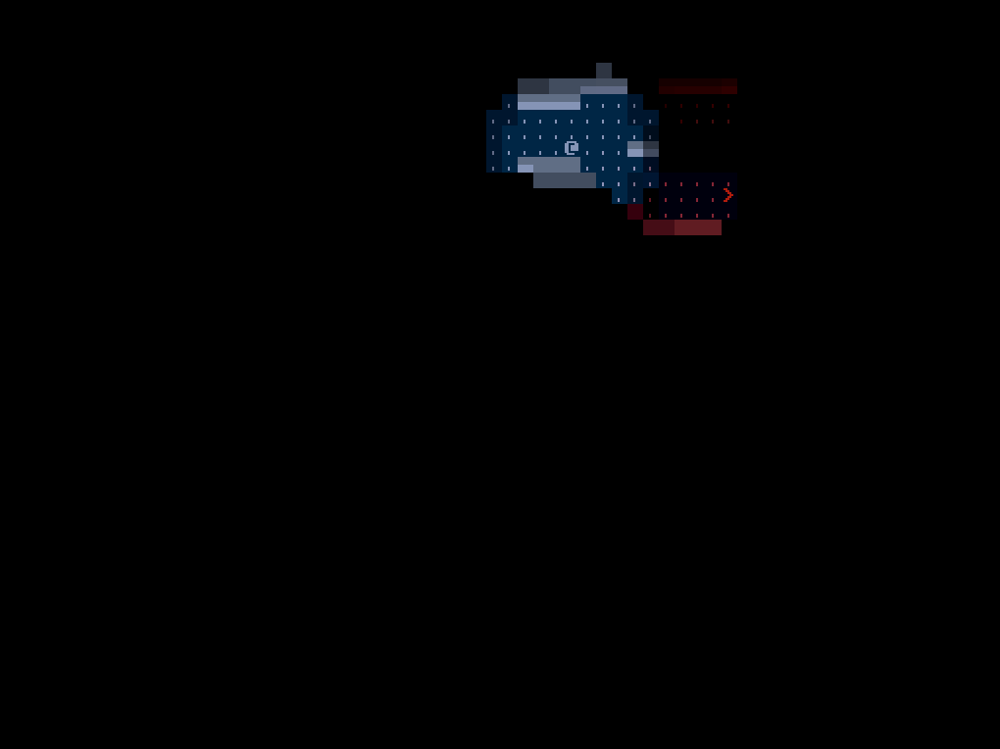
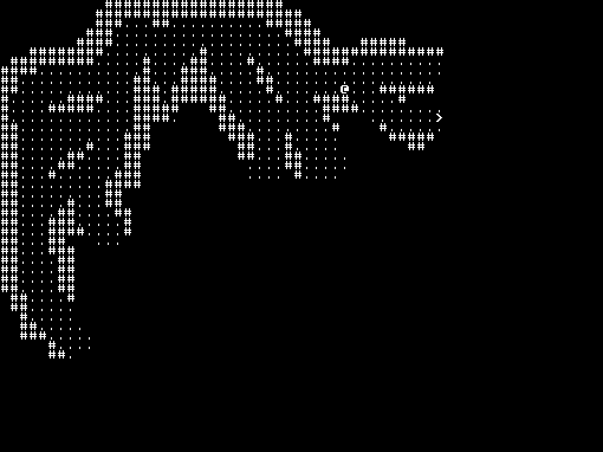

+++
title = "7 Day Roguelike 2019: Procgen and Basic Pathfinding"
date = 2019-03-03T22:00:00+10:00
path = "7drl2019-day1"

[taxonomies]
tags = ["gamedev", "roguelikes", "7drl"]
+++

I configured WFC for generating spiky caves.
Much like staring at clouds, I often recognise shapes in the generated levels:

<!-- more -->

Unfortunately in the finished game the internal details won't be visible to the
player.

Here's the input to WFC:

I also had to manually constrain WFC with some hand-crafted rules, such as
never choosing a fully-white tile, and preventing certain border tiles from
appear too far from the edge.

I made a little tool to converts images into text files which are parsed
by the engine. I preferred this to having the engine parse images directly
because it would add dependencies and slow down builds.

Generating terrain in the game engine (I haven't updated the tile set yet!):

Post-processing to fill all but the largest contiguous open spaces (and replacing trees with walls):

Fixing up the colours and positioning the player and stairs:

Turning off omniscience and ambient light:

The walls are made of ice, so light penetrates two cells deep.

A problem I've noticed with diminishing lighting in roguelikes is showing players
discovered-but-not-visible areas. If light diminishes to near black at the edge
of the player's vision, what colour do you make the previously discovered area
just beyond the player's vision? Normally you would render it darker than the
visible area, or maybe render it in greyscale, but neither of these look very
satisfying.

I propose an alternative. Press 'm' to toggle the map:

This feature was already in the engine prior to the 7drl, but I thought it merits mention here.

## The Bad

### Fast builds or fast terrain generation: Choose one

Running WFC compiled in debug mode is slow. Terrain generation takes 10s of
seconds in debug builds, and 1-2 seconds in release builds. It's much faster
to compile in debug mode than release mode. Being able to quickly make a change
and test it out is valuable when working on a game. Long term it would be worth
making a pre-built release-mode WFC binary which is separate from the game binary,
and having the game binary invoke the WFC binary. This way I can run build the
game in debug mode (quickly) and invoke a release build of the WFC algorithm.

I'll investigate this after the 7drl is done. Until then, building in release mode
without link-time optimisation seems to minimise the sum of build time and
terrain generation time.

## The Good

### Rapidly prototyping WFC input images

On a similar, but more positive note, I've come up with a workflow for crafting
input images and manual constraints for WFC, where I draw an image in a paint program,
run WFC on it, and inspect the output, also in a paint program. If output tiles
show up in places where I don't want them, I find the tile's location in the input
(manually,s but this is easy), and update the constraints to prevent that tile
from showing up. Rinse and repeat.
Once I'm happy with the configuration, I export the image to a text file with my
tool, and add the constraints to the game code.

### Deterministic RNG

The [wfc](https://github.com/gridbugs/wfc) repo contains a number of example apps
for generating images and **each one prints its rng seed when it starts**.
This is massively useful, since if there's an anomalous output indicating a bug in
my WFC implementation or a missing constraint for level generation I can re-run
the generation **with the same seed** after attempting to fix the tool.
I can also add debugging printouts and rerun the tool and trace what happened.
If the problem manifests itself
1% of the time, it would otherwise be nearly impossible to confirm that the bug is
fixed.

The game engine also prints out the rng seed each time it runs for the same reason.

### WFC Anchoring Protocol

What's with the red lines along the bottom and right side of the generated and sample
images? It's a trick to force WFC to only put tiles on the border of the output
if they appear on the border of the input. You just have to make sure that the bottom-right
tile in the input is placed at the bottom-right of the output, and add a constraint
that the bottom-right tile not appear anywhere else in the output.

## A note on pathfinding

Last year I made a library called [grid-search](https://github.com/gridbugs/grid-search)
for doing pathfinding on a grid. I'm using this library again this year. It's largely
unchanged. Pathfinding works, but NPCs still walk through one another and don't
interact with the player at all. Also, NPCs swarm towards the player, even if they
haven't seen the player yet. A simple fix for the latter is to only wake up NPCs
when the player first sees them.

The only part of grid-search that I actually use in this game (and last year's game)
is distance maps, a data structure storing the distance between every cell in the grid
to the player (or other points of interest). After the 7drl I will split distance maps
into their own library and stop maintaining grid-search (not that I'm really doing much
maintenance anyway.

## End of Day 1 Screenshot

