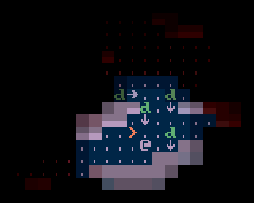

+++
title = "7 Day Roguelike 2019: Physics and Improved Pathfinding"
date = 2019-03-04T22:00:00+10:00
path = "7drl2019-day2"

[taxonomies]
tags = ["gamedev", "roguelikes", "7drl"]
+++

The most notable feature from tonight is NPCs pre-commit
to an action before the player takes their turn. This
means the game can telegraph enemy actions to the player,
which lets the player better plan ahead in combat.

When an NPC is choosing where to move, it will avoid cells
which either currently contain an NPC, or which an NPC has
already committed to moving into. This does mean NPCs will tend
to be more spread out.

<!-- more -->

NPCs now only act if they have line of sight
to the player, but they do have a higher vision distance than the player,
so they can still walk into your visible area. This is a cheap way to
prevent NPCs pathing towards the player from the other side of the map.

## Physics

The player can no longer walk through walls or NPCs. There is basic bump
combat, but no damage system yet. I made an animation system so you can see
when take and deal damage without the need for a message log.

## End of day video

{{ video_player_mp4_autoplay_loop(src="eod.mp4") }}

## Wishlist

I'm going to maintain a wishlist for the remainder of the week, and turn it into
a todo list after the 7drl.

- Split up grid-search into smaller libraries. The current library tries to be too much
  and it makes it harder to use. Specifically I want a richer distance map library
  and a dedicated library for Jump Point Search (a flavour of A*). These should cover all my
  pathfinding needs.
- Querying a WFC input image for all the pattern ids containing a certain colour.
  Generating terrain often requires restricting the level boundary from appearing in the
  middle of the level, and it's currently clunky to enumerate (by hand) enough of the relevant
  pattern ids to forbid from the centre.
- A standalone WFC binary which can be built with optimisations, and an interface for non-optimised
  programs to invoke it.
- Frequently I want a grid of values which I effectively clear and re-populate on each frame/turn.
  Rather than actually clearing each cell, I maintain a frame/turn count, and store in each cell,
  the last frame/turn on which it was updated. If a cell's count is different from the current frame/turn
  count, the cell is treated as empty. It might be worth generalising this and putting it in its own
  library.
- The glutin frontend of prototty does weird things when you open a window on one monitor, and then
  move the window to a different monitor. It looks like the foreground and background of tiles gets
  out of sync.
